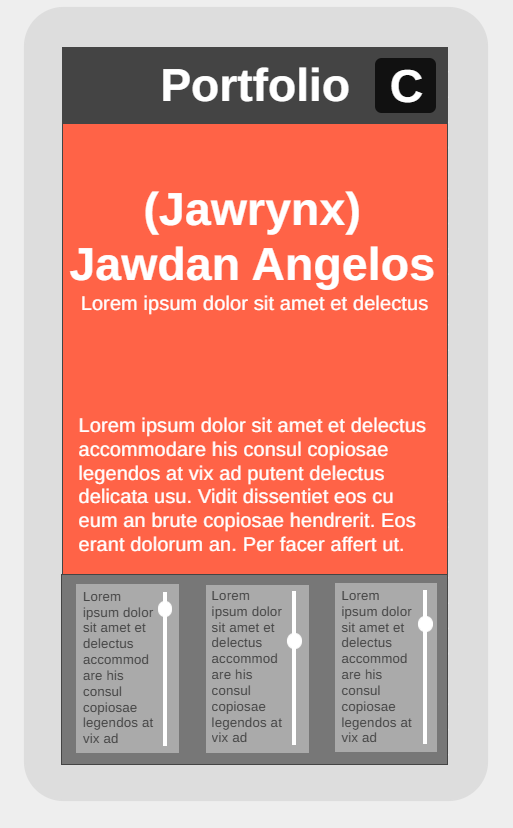
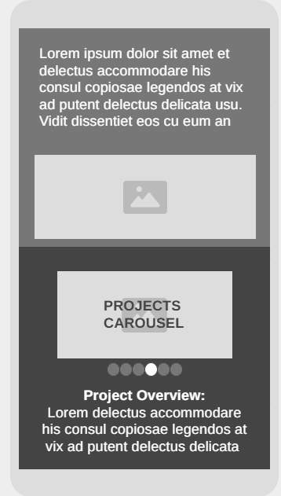
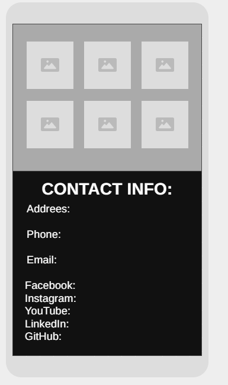
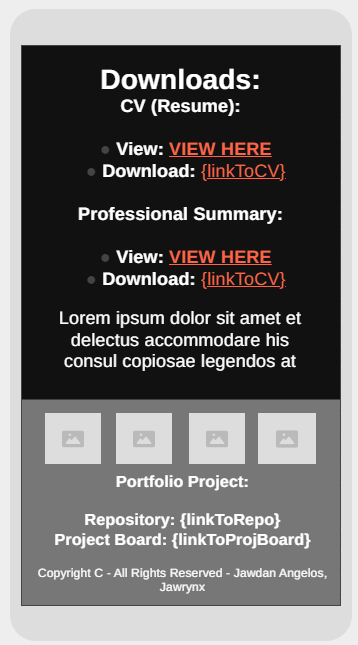
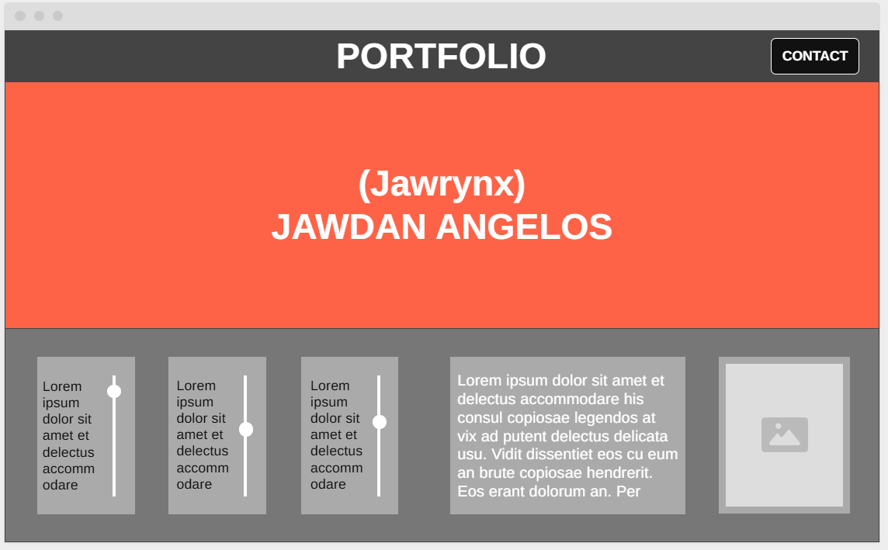
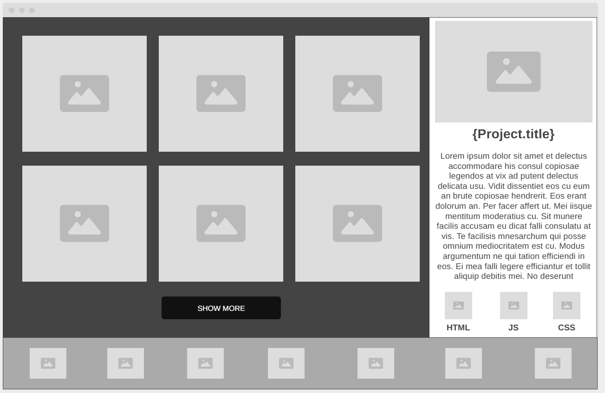
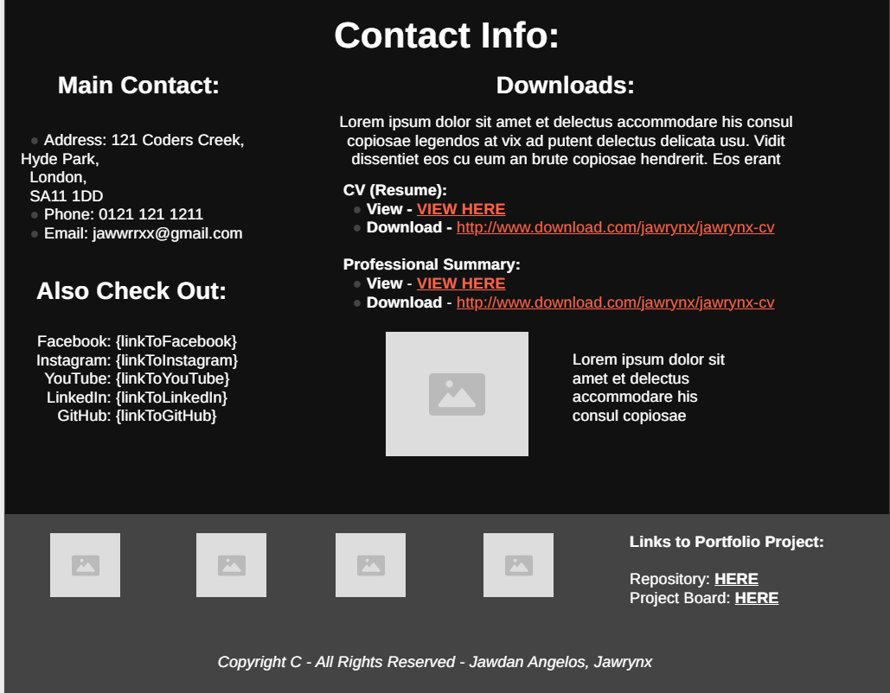

# Portfolio Project

## Details

* **Author:** Jawdan Angelos (Jawrynx)
* **Project Description:** This portfolio project serves as a comprehensive showcase of my skills, technical abilities, and project developments. It's designed to provide developers and potential employers easy access to information regarding my CV, past projects, learned technologies/languages/skills, personal goals, and work specialities.


## Project Goals

The primary goals of this portfolio are to:

* **Present a professional online presence:** Create a clean, responsive, and visually appealing platform to highlight my work.
* **Showcase technical proficiency:** Demonstrate my abilities in various web development technologies through live projects and well-documented code.
* **Facilitate easy communication:** Provide clear contact information and links to my professional profiles.
* **Document my learning journey:** Reflect on personal goals and the growth achieved through various projects.


## Wireframes & Initial Design

To plan the layout and user experience, I created a set of wireframes outlining the structure for both mobile and desktop views. These provide a foundational understanding of the intended user interface before development began. Ofcourse the initial wireframes are NOT the final design and the project will look much better than the wireframes!

You can view the full set of wireframes in the `.documentation/` folder, or see the key sections below:

### Mobile Wireframes

* **Top Section:**
    
* **Mid Section:**
    
* **Mid-Bottom Section:**
    
* **Bottom Section:**
    

### Desktop Wireframes

* **Top Section:**
    
* **Mid Section:**
    
* **Bottom Section:**
    


## Technologies Used

This project is being built using:

* **Front-End:** HTML5, CSS3, JavaScript (ES6+)
* **Version Control:** Git, GitHub
* **Deployment:** GitHub Pages
* **Tools:** VS Code


## Installation & Setup

To get a local copy up and running, follow these simple steps:

1.  **Clone the repository (bash / git-bash / direct download):**
    ```bash
    git clone [https://github.com/Jawrynx/Portfolio.git](https://github.com/Jawrynx/Portfolio.git)
    ```
2.  **Run The Project!**
    Simply navigate to the project directory and run index.html in your preferred browser!

## License

Distributed under the MIT License. See `LICENSE` for more information.


## Contact

* **Your Name:** Jawdan Angelos
* **GitHub:** [https://github.com/Jawrynx](https://github.com/Jawrynx)
* **LinkedIn:** [https://www.linkedin.com/in/jawdan-angelos-b7217a31b/](https://www.linkedin.com/in/jawdan-angelos-b7217a31b/)
* **Email:** [jawrynx@gmail.com](jawrynx@gmail.com)


## Acknowledgements

* [Codecademy Full-Stack Engineer Path](https://www.codecademy.com/)
* [Font Awesome](https://fontawesome.com/)